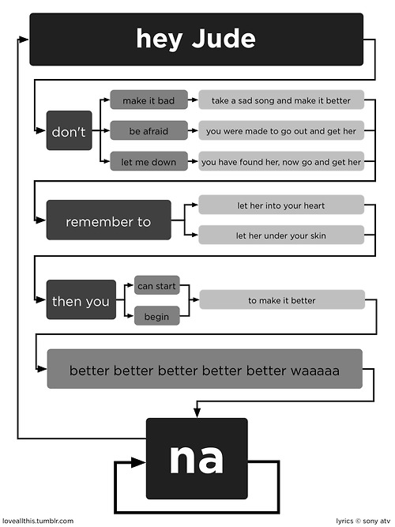

# Table of Contents

1.  [Introduction](#s1)
2.  [Language definition](#org94b849b)
    1.  [Alphabet, Sentence and Language](#org3eeb59c)
    2.  [Lexem and Token:](#org5baf52c)
3.  [Context-Free Grammars, BNF, E-BNF](#org7f445cd)
    1.  [Ambigious and non-Ambigious grammars:](#orgeac8031)
4.  [Conclusion](#org24234c5)

# Introduction

Today I am going to review some of the topics related to the course. While we
are doing this, we are also going to solve some examples that may help you
figure out the kind of questions you may have in your mid-term. Let's start.

# Language definition

## Alphabet, Sentence and Language

-   An **alphabet** is finite non-empty set. The element of an alphabet called the
    letters or symbols of the alphabet.
-   A **sentence** is a string of characters over some alphabet.
-   A **language** is a set of sentences.

Lets have a look at an example:

-   Here is the alphabet for our language:

    A={a b... z A B .. Z 0 ... 9 _}

This is a possible alphabet for `Python` programming language.

Lets give you a definition based on the alphabet:

digits = (0 | 1 | 2 | 3 | 4 | 5 )\*
words = (a | b | c | d | e | f | g ) +
pattern =  word ( \_ | (digits)\*)

Let's write some valid patterns based on this definition:

-   pattern1 = abz\_
-   pattern2 = abcd0128
-   pattern3 = abc345
-   pattern4 = g\_

Give me one more valid and invalid pattern. Justify your answer:

-   valid pattern :
-   in-valid pattern :

    A={a b ... z A B ... z 0 ... 9 _ '}

This is another possible alphabet for `Haskell` programming language.

Let's define a different pattern definition:

digits (1|2| &#x2026; |9)+
words = (A|B| &#x2026; |Z | ')\*
pattern digits ( ' | (\_ words)\*)

Give me some valid and invalid patterns:

-   Validpattern1 : 123'
-   Validpattern2 :
-   Validpattern3 :
-   Validpattern4 :

-   Invalidpattern1 : 10233WoRD'
-   Invalidpattern2 :
-   Invalidpattern3 :
-   Invalidpattern4 :

Lets define a regular expression:

((a|b|c|d|&#x2026;|z|A|B|&#x2026;|Z|0|1|&#x2026;|9|)+(a|b|c|d|&#x2026;|z|A|B|&#x2026;|Z|0|1|&#x2026;|9|\_)\*(a|b|c|d|&#x2026;|z|A|B|&#x2026;|Z|0|1|&#x2026;|9|)+)@((a|b|&#x2026;|z)+).((a|b|&#x2026;|z)+)

Let's write down some strings matching the above regular expressions:

-   

-   

-   

Let's write some strings that do not match the above regular expression:

-   

-   

-   

## Lexem and Token:

-   A lexeme is the lowest level syntactic unit of a language (\*, sum, begin)

-   A token is a category of lexemes

In a practical programming language, there are a very large number of lexemes,
perhaps even an infinite number. In a practical programming language, there are
only a small number of tokens.

Let's have a look at one simple example

    while (y  >=  t) y  =  y - 3 ;

Let's identify the lexems and tokens here:

<table border="2" cellspacing="0" cellpadding="6" rules="groups" frame="hsides">

<colgroup>
<col  class="org-left" />

<col  class="org-left" />
</colgroup>
<thead>
<tr>
<th scope="col" class="org-left">Lexem</th>
<th scope="col" class="org-left">Token</th>
</tr>
</thead>

<tbody>
<tr>
<td class="org-left">while</td>
<td class="org-left">WHILE</td>
</tr>
</tbody>

<tbody>
<tr>
<td class="org-left">(</td>
<td class="org-left">LPar</td>
</tr>
</tbody>

<tbody>
<tr>
<td class="org-left">y</td>
<td class="org-left">Identifier</td>
</tr>
</tbody>

<tbody>
<tr>
<td class="org-left">&lt;=</td>
<td class="org-left">Comparison</td>
</tr>
</tbody>

<tbody>
<tr>
<td class="org-left">t</td>
<td class="org-left">Identifier</td>
</tr>
</tbody>

<tbody>
<tr>
<td class="org-left">)</td>
<td class="org-left">Rpar</td>
</tr>
</tbody>

<tbody>
<tr>
<td class="org-left">y</td>
<td class="org-left">Identifier</td>
</tr>
</tbody>

<tbody>
<tr>
<td class="org-left">=</td>
<td class="org-left">Assignment</td>
</tr>
</tbody>

<tbody>
<tr>
<td class="org-left">y</td>
<td class="org-left">Identifier</td>
</tr>
</tbody>

<tbody>
<tr>
<td class="org-left">-</td>
<td class="org-left">Arithmetic</td>
</tr>
</tbody>

<tbody>
<tr>
<td class="org-left">3</td>
<td class="org-left">Integer</td>
</tr>
</tbody>

<tbody>
<tr>
<td class="org-left">;</td>
<td class="org-left">Semicolon</td>
</tr>
</tbody>
</table>

As you can see we have an almost unlimited number of lexems while we are going to end
up with a limited number of lexical categories (Tokens).

Let's look at another example:

    A = {t r u e f a l s e u c p d o i h n Z 0 ( ) ;}

<table border="2" cellspacing="0" cellpadding="6" rules="groups" frame="hsides">

<colgroup>
<col  class="org-left" />

<col  class="org-left" />
</colgroup>
<thead>
<tr>
<th scope="col" class="org-left">Lexem</th>
<th scope="col" class="org-left">Token</th>
</tr>
</thead>

<tbody>
<tr>
<td class="org-left">isZero</td>
<td class="org-left">IsZero</td>
</tr>
</tbody>

<tbody>
<tr>
<td class="org-left">(</td>
<td class="org-left">LPar</td>
</tr>
</tbody>

<tbody>
<tr>
<td class="org-left">predecessor</td>
<td class="org-left">operator</td>
</tr>
</tbody>

<tbody>
<tr>
<td class="org-left">sucessor</td>
<td class="org-left">operator</td>
</tr>
</tbody>

<tbody>
<tr>
<td class="org-left">isZero</td>
<td class="org-left">operator</td>
</tr>
</tbody>

<tbody>
<tr>
<td class="org-left">)</td>
<td class="org-left">Rpar</td>
</tr>
</tbody>

<tbody>
<tr>
<td class="org-left">true</td>
<td class="org-left">constant</td>
</tr>
</tbody>

<tbody>
<tr>
<td class="org-left">false</td>
<td class="org-left">constant</td>
</tr>
</tbody>

<tbody>
<tr>
<td class="org-left">0</td>
<td class="org-left">Zero</td>
</tr>
</tbody>

<tbody>
<tr>
<td class="org-left">if then else</td>
<td class="org-left">conditional</td>
</tr>
</tbody>

<tbody>
<tr>
<td class="org-left">;</td>
<td class="org-left">EOF</td>
</tr>
</tbody>
</table>

# Context-Free Grammars, BNF, E-BNF

In formal language theory, a context-free grammar (CFG) is a formal grammar
whose production rules are of the form

    A -> alpha

with **A** as a **nont-terminal** symbol and **alpha** as **terminal** / **non-terminal**
/ **empty** symbols.

Backus-Naur form (BNF): In BNF, abstractions are used to represent classes of
syntactic structures&#x2013;they act like syntactic variables (also called nonterminal
symbols, or just terminals)

Let's have a look at one example:

Other name for non-terminal symbol is abstractions.

Abstractions can have more than one RHS

    <program> → <stmts>
    <stmts> → <stmt> | <stmt> ; <stmts>
    <stmt> → <var> = <expr>
    <var> → a|b|c|d
    <expr> → <term> + <term> | <term> - <term> <term> → <var> | const

Can you identify non-terminal and terminal symbols here?

Let's have a look at another example:

    ⟨H_ID⟩  → ⟨head⟩ ⟨tail⟩
    ⟨head⟩  → ⟨upper⟩ | ⟨lower⟩
    ⟨tail⟩  → ⟨upper⟩ | ⟨lower⟩ | ⟨special⟩ | ⟨digit⟩ | ’
    ⟨lower⟩ → a|b|c|d|e|f|g|h|i|j|k|l|m|n|o|p|q|r|s|t|u|v|w|x|y|z|
    ⟨upper⟩ → A|B|C|D|E|F|G|H|I|J|K|L|M|N|O|P|Q|R|S|T|U|V|W |X|Y|Z
    ⟨digit⟩ → 0|1|2|3|4|5|6|7|8|9

can you identify the terminal and non terminal symbols here:

Let's define some valid identifiers:

-   Valididentifier1: habib1'
-   Valididentifier2: Habib2'
-   Valididentifier3: HhAaBbIiBb

Let's define some invalid identifiers:

-   Invalididentifier: 1Habib
-   Invalididentifier:
-   Invalididentifier:

Let's have a look at another interesting activity:

<https://www.ics.uci.edu/~pattis/ICS-31/lectures/tokens.pdf>

Let's do an fun activity together:

Lets write a EBNF grammar for this song:

    ⟨Song⟩ ::= ⟨Jude⟩ { ⟨Jude⟩ }
    ⟨Jude⟩ ::= hey Jude don’t ⟨line 1⟩ remember to ⟨line 2⟩ then you (can start | begin) to make it better
    ⟨nas⟩
    ⟨line1⟩ ::= make it bad take a sad song and make it better
                | be afraid you were made to go out and get her
                | let me down you have found her, now go and get her
    ⟨line2⟩ ::= let her into your heart
                | let her under your skin
    ⟨nas⟩ ::= na {na}

Now lets have a look at a bit harder case.

-   For loop in C:

    ⟨C For Loop⟩ ::= for ( ⟨initializer⟩ ; ⟨conditional⟩ ; ⟨update⟩ ) ’{’ ⟨Statements⟩ ’}’

-   Exercise: Define  EBNF grammar for tuples in `Python`:

## Ambigious and non-Ambigious grammars:

A grammar is ambiguous if and only if it generates a sentential form that has
two or more distinct parse trees:

    E -> E+E|id

Now let's have a look at a bit more different example. See how we could figure
out if it is ambiguous or not:

    S ->  if E then S else S
    S ->  begin S L
    S ->  print E
    L -> end
    L -> S L
    E ->  num = num

What do you think about this grammar?

-   S expression starts either with an IF, BEGIN, or PRINT token,

-   L expression start with an END or a SEMICOLON token,

-   E expression has only one production.

What about the following grammar?

    E -> E-E | id

Define some of the strings in the language:

    { id, id-id, id-id-id, ….}

Consider the following string in the language by replacing terminal `id` with
`3`.

    3 - 3 - 3 

Here is what we may expect:

How we could make this grammar unambiguous?

1.  Precedence:

If different operators are used, we will consider the precedence of the
operators. The three important characteristics are :

1.  The level at which the production is present denotes the priority of the
    operator used.
2.  The production at higher levels will have operators with less priority. In
    the parse tree, the nodes which are at top levels or close to the root
    node will contain the lower priority operators.
3.  The production at lower levels will have operators with higher priority.
    In the parse tree, the nodes which are at lower levels or close to the
    leaf nodes will contain the higher-priority operators.

1.  Associativity:

If the same precedence operators are in production, then we will have to
consider the associativity.

1.  If the associativity is left to right, then we have to prompt a left
    recursion in the production. The parse tree will also be left recursive
    and grow on the left side.
2.  +, -, \*, / are left-associative operators.
3.  If the associativity is right to left, then we have to prompt the right
    recursion in the productions. The parse tree will also be right recursive
    and grow on the right side.
4.  ^ is a right associative operator.

-   Make the grammar left recursive:
    -   Replace the most non-terminal E in the RHS with another random variable.

    E -> E – P | P
    P -> id

-   Consider the following grammar:

    E -> E + E | E * E | id

Is this ambiguous? How we could prove that? If it is, how we could show it is
not

-   example: 3+2\*5

    E -> E + P           // + is at higher level and left associative
    E -> P 
    P -> P * Q          // * is at lower level and left associative
    P -> Q  
    Q -> id

What about this example?

    E -> T + E
    E -> T
    T -> int
    T -> int * T
    T -> ( E )

-   E starts with T or T + E
-   T starts with int or int \* T or (E)
    
    Definitely, this is not predictive grammar.
    
    How could we make it predicitve?
    
    Let's add up some random non-terminals to the grammar to make it predictive.

    E -> T X
    X -> + E 
    X -> epsilon
    T -> (E)
    T -> int Y
    Y -> * T
    Y -> epsilon

-   Check all the repetitive terminal symbols
-   Make sure for each non-terminal is either only one rule or every rule starts
    with a terminal or epsilon.
-   Maker sure your parse tree always be left recursive.
-   More you expand your grammar, you can make it more predictive.

# Conclusion

-   It is important for you to read the material for the first four chapters of the
    tex book and be familiar with what is going on with assignment number one.

-   Remember to review all the material related to tokens, lexems, lexical and
    syntax analysis.

-   Very important to understand how BNF and EBNF are working and how to generate
    strings based on them. You also need to be able to distinguish the valid and
    invalid strings.

-   Try to understand how to create a parse tree for a derivation of a grammar and
    how to figure out if it is ambiguous or not. You should be able to figure out
    to solve the ambiguity it is possible.

-   You should have access to the solution of Assignment number 1. Try to
    understand how each of the hleper functions are working and how you could use
    them if it is necessary.

